## 📝 Lab Assignment 3: Symmetric encryption & hashing

- [✅ Task – 1: AES encryption using different modes](./Tasks-Solutions/Tasks-1.md)

- [✅ Task – 2: Encryption mode - ECB vs CBC](./Tasks-Solutions/Tasks-2.md)

- [✅ Task – 3: Encryption mode – corrupted cipher text](./Tasks-Solutions/Tasks-3.md)

- [✅ Task – 4: Padding in Different Mode](./Tasks-Solutions/Tasks-4.md)

- [✅ Task – 5: Generating message digest](./Tasks-Solutions/Tasks-5.md)

- [✅ Task – 6: Keyed hash and HMAC](./Tasks-Solutions/Tasks-6.md)

- [✅ Task – 7: Keyed hash and HMAC + Bonus Task](./Tasks-Solutions/Tasks-7.md)

<hr>

## Task – 1: AES encryption using 3 different modes

- Create a New File `plain.txt` and adding several lines of texts

```bash
    nano plain.txt
```

```plaintext
    Hlw ! I am Sumonta Saha Mridul. This is a sceret Message !
```

```bash
    ghex plain.txt
```

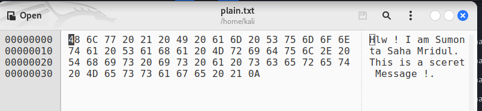

1. **✅ Encrypt the file using AES encryption in ECB mode && Cipher Type `-aes-128-ecb`**

```bash
    openssl enc -aes-128-ecb -e -in plain.txt -out cipher1.bin -K 00112233445566778889aabbccddeeff
```

- Lets See Inside the Encrypted File

```bash
    cat cipher1.bin
```

- Decrypt the file using AES encryption in ECB mode && Cipher Type `-aes-128-ecb`

```bash
    openssl enc -aes-128-ecb -d -in cipher1.bin -out decipher1.txt -K 00112233445566778889aabbccddeeff
```

```bash
    cat decipher1.txt
```

```bash
    ghex decipher1.txt
```

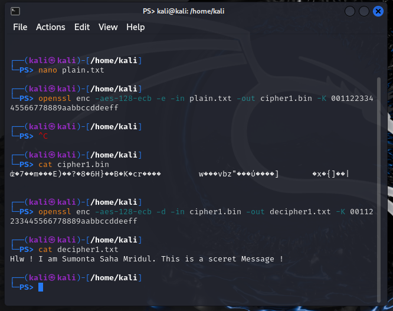
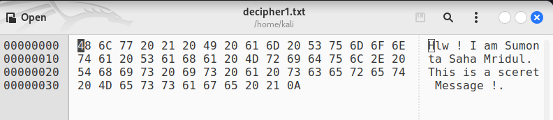

<hr>

2. **✅ Encrypt the file using AES encryption in CBC mode && Cipher Type `-aes-128-cbc`**

```bash
    openssl enc -aes-128-cbc -e -in plain.txt -out cipher2.bin -K 00112233445566778889aabbccddeeff -iv 01020304050607080550101410114501
```

- Lets See Inside the Encrypted File

```bash
    cat cipher2.bin
```

- Decrypt the file using AES encryption in ECB mode && Cipher Type `-aes-128-cbc`

```bash
    openssl enc -aes-128-cbc -d -in cipher2.bin -out decipher2.txt -K 00112233445566778889aabbccddeeff -iv 01020304050607080550101410114501
```

```bash
    cat decipher2.txt
```

```bash
    ghex decipher2.txt
```

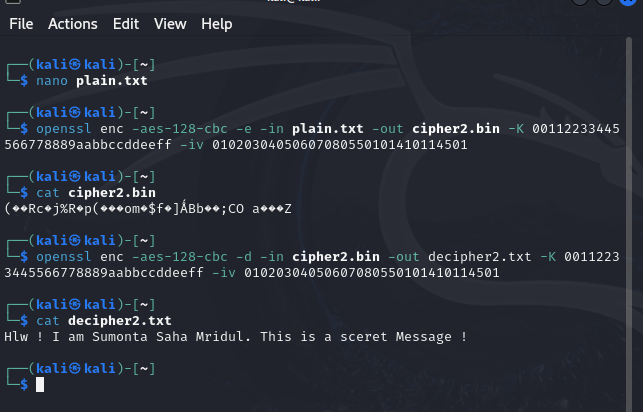
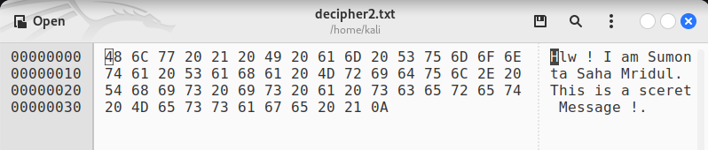

<hr>

3. **✅ Encrypt the file using AES encryption in CFB mode && Cipher Type `-aes-128-cfb`**

```bash
    openssl enc -aes-128-cfb -e -in plain.txt -out cipher3.bin -K 00112233445566778889aabbccddeeff -iv 01020304050607080550101410114501
```

- Lets See Inside the Encrypted File

```bash
    cat cipher3.bin
```

- Decrypt the file using AES encryption in ECB mode && Cipher Type `-aes-128-cfb`

```bash
    openssl enc -aes-128-cfb -d -in cipher3.bin -out decipher3.txt -K 00112233445566778889aabbccddeeff -iv 01020304050607080550101410114501
```

```bash
    cat decipher3.txt
```

```bash
    ghex decipher3.txt
```

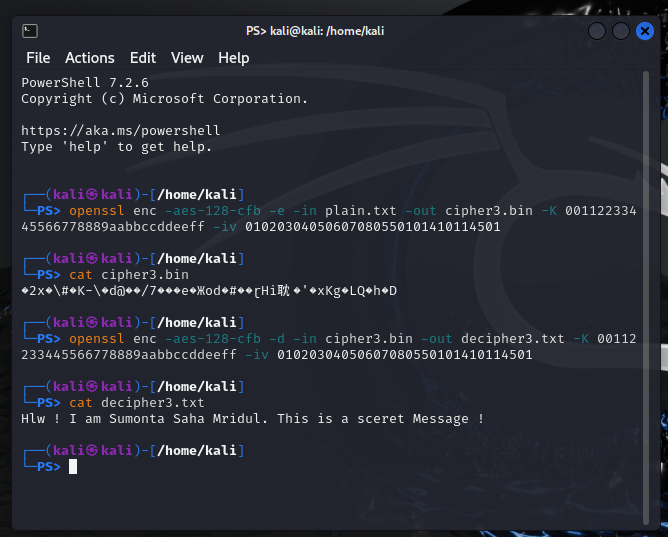
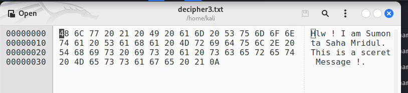

<hr>

## Task – 2: Encryption mode - ECB vs CBC

- Using this image as an input


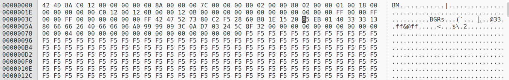

1. **✅ Encrypt the image using AES encryption in ECB mode && Cipher Type `-aes-128-ecb`**

```bash
   openssl enc -aes-128-ecb -in panda.bmp -out image_ecb.bmp -K 0123456789abcdef0123456789abcdef
```

- Lets See Inside the Encrypted File

```bash
    ghex image_ecb.bmp
```

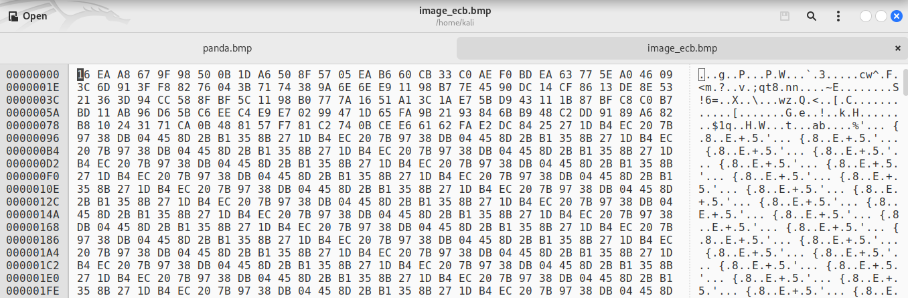

- Reconstruct the header file of the encrypt with ghex from the original file.
- Replacing the first 54 bytes of image_ecb.bmp with the first 54 bytes of panda.bmp


- **🔖 We Can See ECB encryption exposes patterns in the encrypted image of the original image.**

<hr>

2. **✅ Encrypt the image using AES encryption in CBC mode && Cipher Type `-aes-128-cbc`**

```bash
   openssl enc -aes-128-cbc -in panda.bmp -out image_cbc.bmp -K 0123456789abcdef0123456789abcdef -iv 0123456789abcdef0123456789abcdef
```

- Lets See Inside the Encrypted File

```bash
   ghex image_cbc.bmp
```

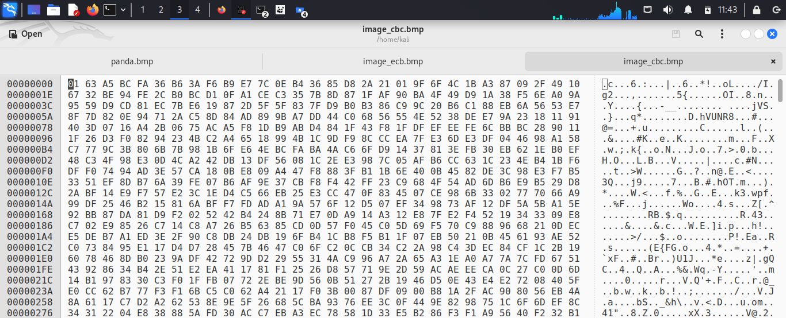

- Reconstruct the header file of the encrypt with ghex from the original file.
- Replacing the first 54 bytes of image_cbc.bmp with the first 54 bytes of panda.bmp


- **🔖 We Can See CBC encryption doesn't exposes patterns in the encrypted image of the original image.**

<hr>

## Task – 3: Encryption mode – Corrupted Cipher Text

#### ❓ Question : How much information can you recover by decrypting the corrupted file, if the encryption mode is ECB, CBC, CFB, or OFB, respectively?

- **ECB Mode Recovery**: In ECB mode, each block of plaintext is encrypted independently of other blocks. This means that if a single block is corrupted, only that specific block can be decrypted without affecting the others. Therefore, you can recover the entire file except for the corrupted block.

- **CBC Mode Recovery**: CBC mode uses an IV (Initialization Vector) and chains the encryption of each block to the previous one. If a block is corrupted, it cannot be decrypted without the corresponding ciphertext block. However, if you have the corrupted ciphertext block and the IV, you can decrypt the entire file except for the corrupted block.

- **CFB Mode Recovery**: Similar to CBC, CFB also chains the encryption of each block to the previous one. The difference lies in how the chaining is done. If a block is corrupted, it cannot be decrypted without the corresponding ciphertext block. Recovery depends on having the corrupted ciphertext block and the IV.

- **OFB Mode Recovery**: OFB mode generates a keystream block by block and XORs it with the plaintext block to produce the ciphertext. If a block is corrupted, it cannot be decrypted without the corresponding ciphertext block. Recovery depends on having the corrupted ciphertext block and the IV.

#### ❓ Question : Why These Differences?

The differences in recovery capabilities stem from how each mode processes and encrypts data:

1. ECB treats each block as independent, making it easier to recover data but less secure against patterns in the plaintext.
2. CBC, CFB, and OFB all introduce some form of chaining or feedback mechanism, which makes them more secure against patterns but also complicates recovery from corrupted blocks because they depend on the integrity of the entire chain.

#### ❓ Question : What are the implications of these differences?

1. ECB (Electronic Codebook): This method has a weakness in that it is susceptible to plaintext patterns and does not effectively diffuse information.
2. CBC (Cipher Block Chaining): This technique offers improved diffusion and is more resistant to attacks that utilize known plaintext, compared to ECB.
3. CFB (Cipher Feedback) and OFB (Output Feedback): These modes have the benefit of error propagation, which means that a corruption in one block does not affect the following blocks. This feature can be beneficial in certain situations.

<hr>

### Test Encryption mode – Corrupted Cipher Text

- Create a 64 bytes long Plain.txt

```
Hlw ! I am Sumonta Saha Mridul. This is a sceret Message !
I am doing encryption mode in corrupted cipher text..
Checking what happens i modify some code in decription

Welcome to my document! This is a sample text file created for demonstration purposes. In this document, we'll explore various topics related to technology, science, and creativity. Feel free to edit and customize this text as needed. Remember to save your changes before closing the file. Enjoy exploring!
```

1. **✅ Encrypt the file using AES encryption in ECB mode && Cipher Type `-aes-128-ecb`**

```bash
    openssl enc -aes-128-ecb -e -in plain.txt -out cipher1.bin -K 00112233445566778889aabbccddeeff
```

- Lets See Inside the Encrypted File

```bash
    cat cipher1.bin
```

- Now Open the encrpted File in Ghex

```bash
    ghex cipher1.bin
```

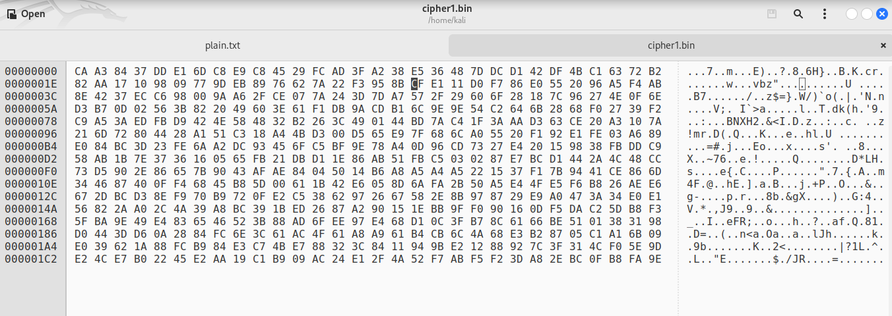

- **Modifying the `30th byte` from `C` to `2`**

- Now Decrypt the file using AES encryption in ECB mode && Cipher Type `-aes-128-ecb`

```bash
    openssl enc -aes-128-ecb -d -in cipher1.bin -out decipher1.txt -K 00112233445566778889aabbccddeeff
```

```bash
    cat decipher1.txt
```

- Lets Look the Decrypted File

```bash
    cat decipher1.txt
```

```
Hlw ! I am Sumonta Saha Mridul. :��ϕQ���vo��z Message !
I am doing encryption mode in corrupted cipher text..
Checking what happens i modify some code in decription

Welcome to my document! This is a sample text file created for demonstration purposes. In this document, we'll explore various topics related to technology, science, and creativity. Feel free to edit and customize this text as needed. Remember to save your changes before closing the file. Enjoy exploring!
```

- **🔖 Here we can see that the `30th byte` is corrupted and the message is not decrypted properly.**

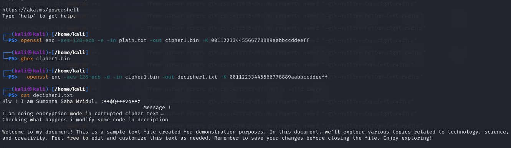

2. **✅ Encrypt the file using AES encryption in CBC mode && Cipher Type `-aes-128-cbc`**

```bash
    openssl enc -aes-128-cbc -e -in plain.txt -out cipher2.bin -K 00112233445566778889aabbccddeeff -iv 01020304050607080550101410114501
```

- Lets See Inside the Encrypted File

```bash
    cat cipher2.bin
```

- Now Open the encrpted File in Ghex

```bash
    ghex cipher2.bin
```

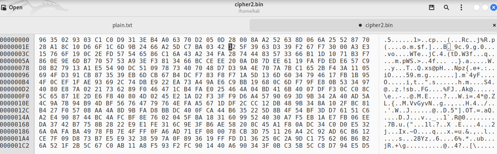

- **Now modify the `30th byte` from `1` to `3`**

- Now Decrypt the file using AES encryption in ECB mode && Cipher Type `-aes-128-cbc`

```bash
    openssl enc -aes-128-cbc -d -in cipher2.bin -out decipher2.txt -K 00112233445566778889aabbccddeeff -iv 01020304050607080550101410114501
```

- Lets Look the Decrypted File

```bash
    cat decipher2.txt
```

```
Hlw ! I am Sumonta Saha Mridul. nq�*!p�ny1�L~.� Message !
I am�doing encryption mode in corrupted cipher text..
Checking what happens i modify some code in decription

Welcome to my document! This is a sample text file created for demonstration purposes. In this document, we'll explore various topics related to technology, science, and creativity. Feel free to edit and customize this text as needed. Remember to save your changes before closing the file. Enjoy exploring!

```

- **🔖 Here we can see that the `30th byte` is corrupted and the message is not decrypted properly.**

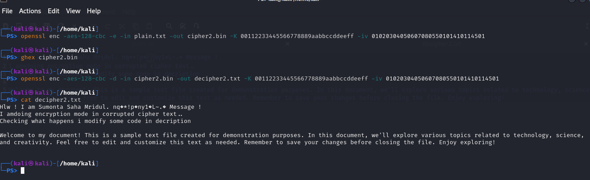

Observation: Different encryption modes like ECB, CBC, CFB, and OFB offer varying levels of resilience to data corruption, with ECB being the least resilient and CFB/OFB providing better error propagation, affecting the recovery of information.

<hr>

## Task – 4: Padding

- **✅ ECB Encryption & Decryption**

```bash
openssl enc -aes-128-ecb -e -in plain.txt -out cipher1.bin -K 00112233445566778889aabbccddeeff
```

```bash
openssl enc -aes-128-ecb -d -in cipher1.bin -out decipher1.txt -K 00112233445566778889aabbccddeeff
```

- **✅ CBC Encryption & Decryption**

```bash
openssl enc -aes-128-cbc -e -in plain.txt -out cipher2.bin -K 00112233445566778889aabbccddeeff -iv 01020304050607080550101410114501
```

```bash
openssl enc -aes-128-cbc -d -in cipher2.bin -out decipher2.txt -K 00112233445566778889aabbccddeeff -iv 01020304050607080550101410114501
```

- **✅ CFB Encryption & Decryption**

```bash
openssl enc -aes-128-cfb -e -in plain.txt -out cipher3.bin -K 00112233445566778889aabbccddeeff -iv 01020304050607080550101410114501
```

```bash
openssl enc -aes-128-cfb -d -in cipher3.bin -out decipher3.txt -K 00112233445566778889aabbccddeeff -iv 01020304050607080550101410114501
```

- **✅ OFB Encryption & Decryption**

```bash
openssl enc -aes-128-ofb -e -in plain.txt -out cipher4.bin -K 00112233445566778889aabbccddeeff -iv 01020304050607080550101410114501
```

```bash
openssl enc -aes-128-ofb -d -in cipher4.bin -out decipher4.txt -K 00112233445566778889aabbccddeeff -iv 01020304050607080550101410114501
```

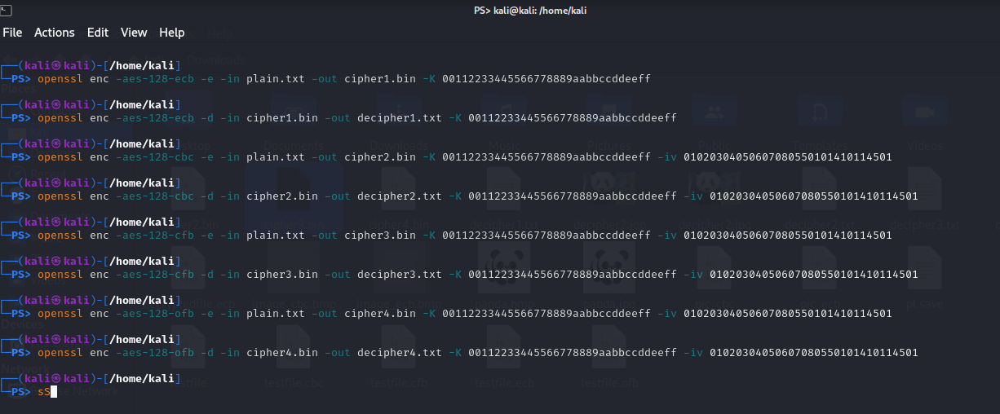

#### Analyze the Results

After running the commands, have encrypted and decrypted files for each mode. Compare the sizes of the original plaintext file and the decrypted files. Observe that the decrypted files are the same size as the original plaintext file, indicating that padding was correctly applied and removed in CBC and CFB modes. In ECB and OFB modes, the sizes may differ due to the nature of these modes, but ECB does not require padding, and OFB does not require padding either.

#### Report Findings

- ECB: No padding is required because it operates on blocks directly.
- CBC: Requires padding because it operates on blocks, and the plaintext length might not match the block size.
- CFB: Requires padding because it operates on blocks of data.
- OFB: Does not require padding because it treats the encryption process as a - stream cipher.

<hr>

## Task – 5: Generating Message Digest

- `Plaint.txt` file is used to generate the hash value using the `SHA-256`, `MD-5`, and `SHA-1` one-way hash algorithm.

```
Hlw ! I am Sumonta Saha Mridul. This is a sceret Message !
```

1. ✅ Generating the hash value for a file using the **`SHA-256` one-way hash algorithm.**

```bash
 openssl dgst -sha256 plain.txt
```

- Output Value:`-sha256` one-way hash algorithm

```bash
SHA2-256(plain.txt)= a1dad895a6659ce91ddc1dbecced50a4c449a43d0d1d7c6f50066e05c1d86bea
```

2. ✅ Generating the hash value for a file using the **`MD-5` one-way hash algorithm.**

```bash
openssl dgst -md5 plain.txt
```

- Output Value: `-md5` one-way hash algorithm

```bash
MD5(plain.txt)= 9698daa45366b06e49732be280a7c675
```

3. ✅ Generating the hash value for a file using the **`SHA-1` one-way hash algorithm.**

```bash
openssl dgst -sha1 plain.txt
```

- Output Value: `-sha1` one-way hash algorithm

```bash
SHA1(plain.txt)= 049e23ff79275222a395988ca14efac47690829e
```

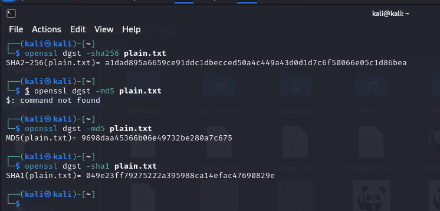

<hr>

## Task – 6: Keyed hash and HMAC

- Using OpenSSL to generate keyed hashes for the created file using HMAC-MD5, HMAC-SHA256, and HMAC-SHA1 algorithms.
- Using different keys of varying lengths for each algorithm.

1. **For `HMAC-MD5`, use a key of 128 bits.**

```bash
openssl dgst -md5 -hmac "mykey" plain.txt
```

2. **For `HMAC-SHA256`, use a key of 256 bits.**

```bash
openssl dgst -sha256 -hmac "mylongerkey" plain.txt
```

3. **For `HMAC-SHA1`, use a key of 160 bits.**

```bash
openssl dgst -sha1 -hmac "myshort" plain.txt
```

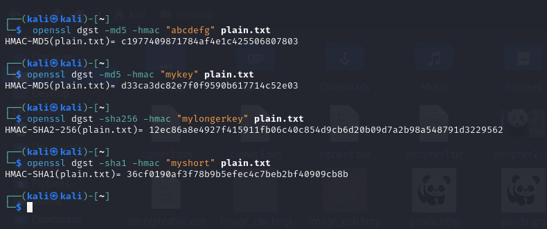

#### 🔖 Addressing the Key Size Requirement

1. **Fixed Size Requirement:**

**HMAC does not require a fixed key size**. The key can be of any length. However, the choice of key length can affect the security of the HMAC. Longer keys generally offer better security against brute-force attacks.

2. **Key Length Recommendation:**

While there's no strict rule, a common recommendation is to use a key that **is at least as long as the output of the hash function**. For MD5, this is 128 bits, for SHA-256, it's 256 bits, and for SHA-1, it's 160 bits. However, using a longer key is always safer.

<hr>

## Task – 7: Keyed hash and HMAC (with Bonus Tasks)

- Plain Text File: `plain.txt`

```
Hlw ! I am Sumonta Saha Mridul. This is a sceret Message !
```

1. **Generate Hash Value H1 : For `HMAC-MD5`, use a key of 128 bits.**

```bash
openssl dgst -md5 -hmac "mykey" plain.txt
```

- **Output** the hash value for H1 for the modified file

```bash
HMAC-MD5(plain.txt)= e6b87de7fed721b49a0b08aef1305024ghhex
```

- Flipping Bit with `ghex` Tool

```bash
ghex plain.txt
```

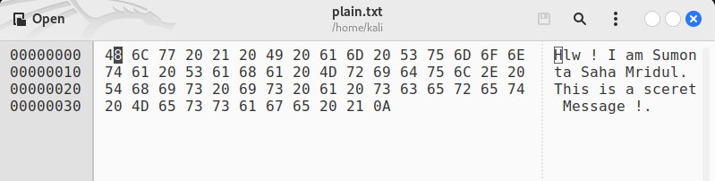

- **Modify the File by Flipping One Bit (Change `61` to `20`)**

- Generate the hash value H2 for the modified file

```bash
openssl dgst -md5 -hmac "mykey" plain.txt
```

- Output the hash value for H2 for the modified file

```bash
HMAC-MD5(plain.txt)= 281db338ab6e5927c2dcd6b238ab9112
```

- **Observation**: H1 and H2 are not similar.

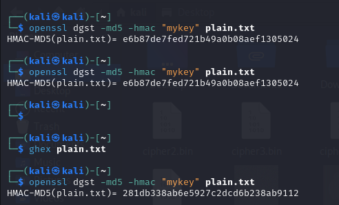

- **Counting how many bits are the same between H1 and H2. (Bonus Task)**

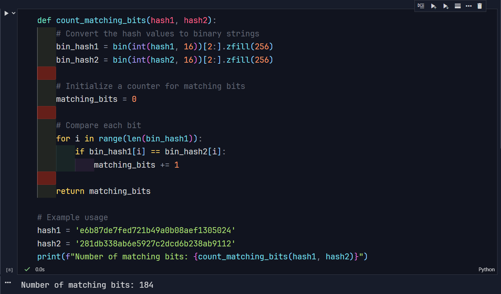

- **Number of matching bits: 184**

<hr>

2. **Generate Hash Value H1 : For `SHA256`, use a key of 256 bits.**

```bash
openssl dgst -sha256 -hmac "mylongerkey" plain.txt
```

- **Output** the hash value for H1 for the modified file

```bash
HMAC-SHA2-256(plain.txt)= 69bf09739792ead4a1f90a9e96235b19ef74bb659f371f9ead59b02fe6f69499
```

- Flipping Bit with `ghex` Tool

```bash
ghex plain.txt
```


- **Modify the File by Flipping One Bit (Change `61` to `20`)**

- Generate the hash value H2 for the modified file

```bash
openssl dgst -sha256 -hmac "mylongerkey" plain.txt
```

- Output the hash value for H2 for the modified file

```bash
HMAC-SHA2-256(plain.txt)= b2e47fcb6f288b15a5a4a010808a0ee1b1247df4826b90427a4e3f470e3af0b7
```

- **Observation**: H1 and H2 are not similar.

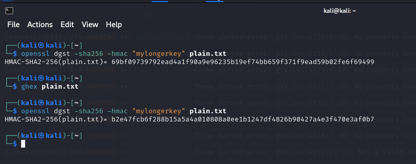

- **Counting how many bits are the same between H1 and H2. (Bonus Task)**

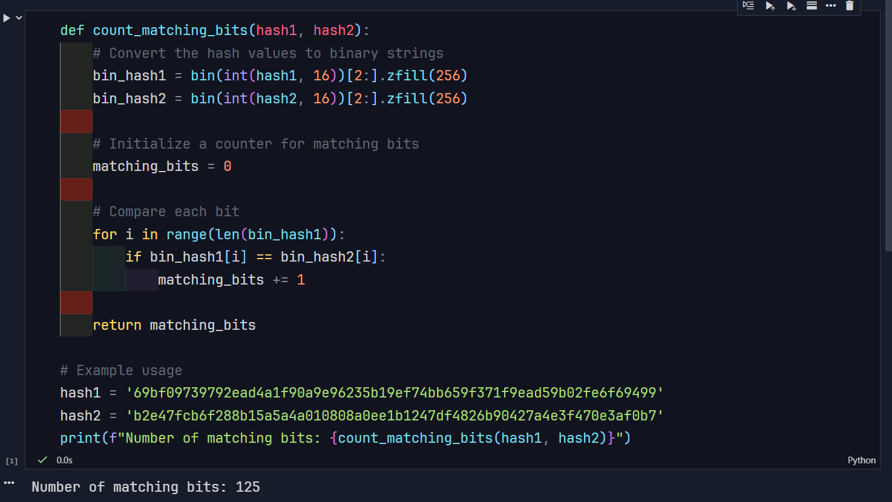

- **Number of matching bits: 125**

<hr>
