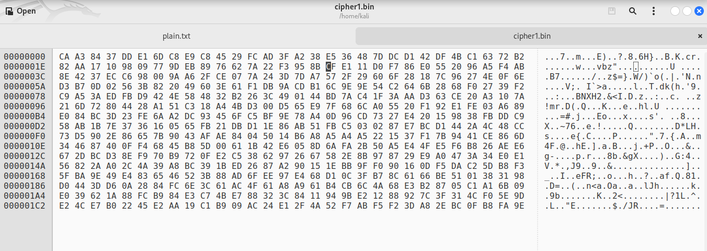
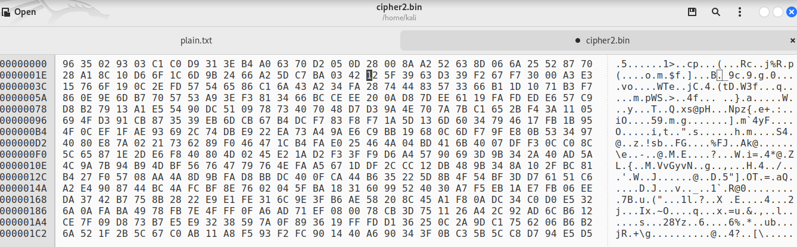
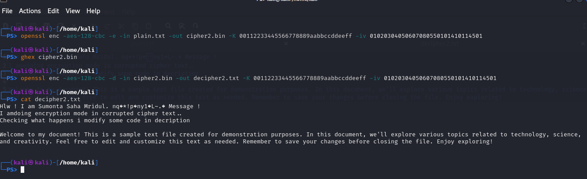

## Task – 3: Encryption mode – corrupted cipher text
- 64 bytes long : Plain.txt

```
Hlw ! I am Sumonta Saha Mridul. This is a sceret Message !
I am doing encryption mode in corrupted cipher text..
Checking what happens i modify some code in decription

Welcome to my document! This is a sample text file created for demonstration purposes. In this document, we'll explore various topics related to technology, science, and creativity. Feel free to edit and customize this text as needed. Remember to save your changes before closing the file. Enjoy exploring!
```

1. Encrypt the file using AES encryption in ECB mode && Cipher Type `-aes-128-ecb`

```bash
    openssl enc -aes-128-ecb -e -in plain.txt -out cipher1.bin -K 00112233445566778889aabbccddeeff
```

- Lets See Inside the Encrypted File

```bash
    cat cipher1.bin
```

- Now Open the encrpted File in Ghex

```bash
    ghex cipher1.bin
```



- Now modify the `30th byte` from `C` to `2`

- Now Decrypt the file using AES encryption in ECB mode && Cipher Type `-aes-128-ecb`

```bash
    openssl enc -aes-128-ecb -d -in cipher1.bin -out decipher1.txt -K 00112233445566778889aabbccddeeff
```

```bash
    cat decipher1.txt
```

- Lets Look the Decrypted File

```bash
    cat decipher1.txt
```

```
Hlw ! I am Sumonta Saha Mridul. :��ϕQ���vo��z Message !
I am doing encryption mode in corrupted cipher text..
Checking what happens i modify some code in decription

Welcome to my document! This is a sample text file created for demonstration purposes. In this document, we'll explore various topics related to technology, science, and creativity. Feel free to edit and customize this text as needed. Remember to save your changes before closing the file. Enjoy exploring!
```

- Here we can see that the `30th byte` is corrupted and the message is not decrypted properly.


2. Encrypt the file using AES encryption in CBC mode && Cipher Type `-aes-128-cbc`

```bash
    openssl enc -aes-128-cbc -e -in plain.txt -out cipher2.bin -K 00112233445566778889aabbccddeeff -iv 01020304050607080550101410114501
```

- Lets See Inside the Encrypted File

```bash
    cat cipher2.bin
```

- Now Open the encrpted File in Ghex

```bash
    ghex cipher2.bin
```



- Now modify the `30th byte` from `1` to `3`

- Now Decrypt the file using AES encryption in ECB mode && Cipher Type `-aes-128-cbc`

```bash
    openssl enc -aes-128-cbc -d -in cipher2.bin -out decipher2.txt -K 00112233445566778889aabbccddeeff -iv 01020304050607080550101410114501
```

- Lets Look the Decrypted File

```bash
    cat decipher2.txt
```

```
Hlw ! I am Sumonta Saha Mridul. nq�*!p�ny1�L~.� Message !
I am�doing encryption mode in corrupted cipher text..
Checking what happens i modify some code in decription

Welcome to my document! This is a sample text file created for demonstration purposes. In this document, we'll explore various topics related to technology, science, and creativity. Feel free to edit and customize this text as needed. Remember to save your changes before closing the file. Enjoy exploring!

```

- Here we can see that the `30th byte` is corrupted and the message is not decrypted properly.


