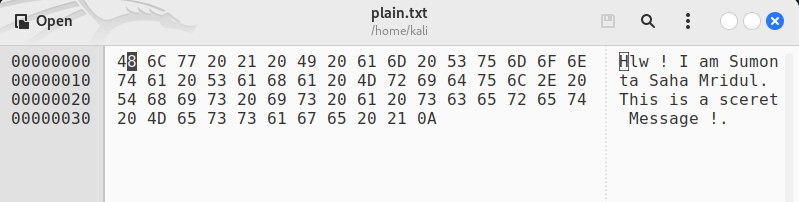
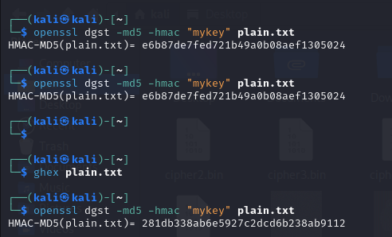
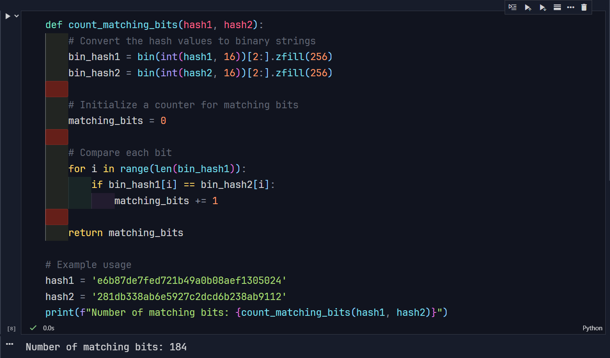

## Task – 7: Keyed hash and HMAC

- Plain Text File: `plain.txt`

```
Hlw ! I am Sumonta Saha Mridul. This is a sceret Message !
```

1. Generate Hash Value H1 : For `HMAC-MD5`, use a key of 128 bits.

```bash
openssl dgst -md5 -hmac "mykey" plain.txt
```

- **Output** the hash value for H1 for the modified file

```bash
HMAC-MD5(plain.txt)= e6b87de7fed721b49a0b08aef1305024ghhex
```

- Flipping Bit with `ghex` Tool

```bash
ghex plain.txt
```



- Modify the File by Flipping One Bit (Change `61` to `20`)

- Generate the hash value H2 for the modified file

```bash
openssl dgst -md5 -hmac "mykey" plain.txt
```

- Output the hash value for H2 for the modified file

```bash
HMAC-MD5(plain.txt)= 281db338ab6e5927c2dcd6b238ab9112
```





- **Number of matching bits: 184**
