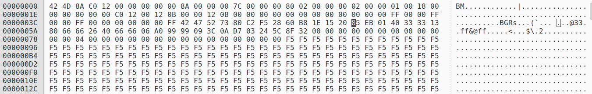
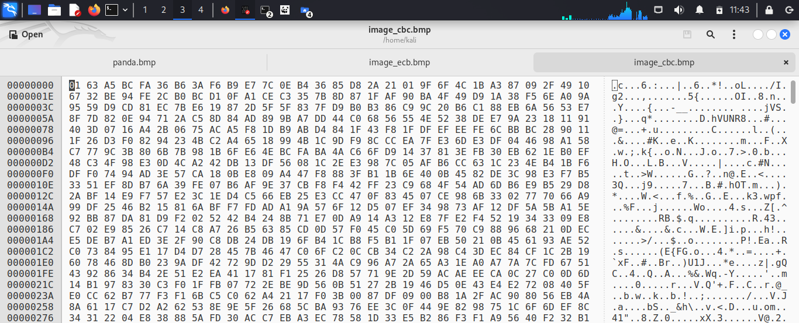

## Task – 2: Encryption mode - ECB vs CBC

- Using this image as an input




1. **✅ Encrypt the image using AES encryption in EBC mode && Cipher Type `-aes-128-ecb`**

```bash
   openssl enc -aes-128-ecb -in panda.bmp -out image_ecb.bmp -K 0123456789abcdef0123456789abcdef
```

- Lets See Inside the Encrypted File

```bash
    ghex image_ecb.bmp
```


- Reconstruct the header file of the encrypt with ghex from the original file.
- Replacing the first 54 bytes of image_ecb.bmp with the first 54 bytes of panda.bmp


- **🔖 We Can See ECB encryption exposes patterns in the encrypted image of the original image.**

<hr>

2. **✅ Encrypt the image using AES encryption in CBC mode && Cipher Type `-aes-128-cbc`**

```bash
   openssl enc -aes-128-cbc -in panda.bmp -out image_cbc.bmp -K 0123456789abcdef0123456789abcdef -iv 0123456789abcdef0123456789abcdef
```

- Lets See Inside the Encrypted File

```bash
   ghex image_cbc.bmp
```



- Reconstruct the header file of the encrypt with ghex from the original file.
- Replacing the first 54 bytes of image_cbc.bmp with the first 54 bytes of panda.bmp


- **🔖 We Can See CBC encryption doesn't exposes patterns in the encrypted image of the original image.**

<hr>
