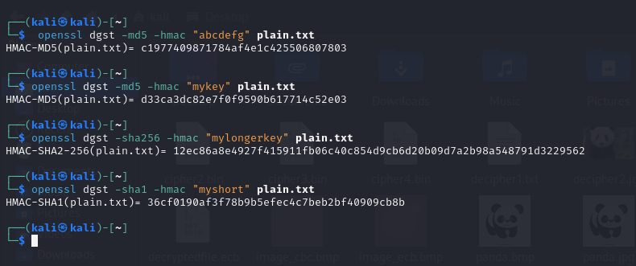

## Task – 6: Keyed hash and HMAC

- Using OpenSSL to generate keyed hashes for the created file using HMAC-MD5, HMAC-SHA256, and HMAC-SHA1 algorithms.
- Using different keys of varying lengths for each algorithm.

1. **For `HMAC-MD5`, use a key of 128 bits.**

```bash
openssl dgst -md5 -hmac "mykey" plain.txt
```

2. **For `HMAC-SHA256`, use a key of 256 bits.**

```bash
openssl dgst -sha256 -hmac "mylongerkey" plain.txt
```

3. **For `HMAC-SHA1`, use a key of 160 bits.**

```bash
openssl dgst -sha1 -hmac "myshort" plain.txt
```



#### 🔖 Addressing the Key Size Requirement

1. **Fixed Size Requirement:**

**HMAC does not require a fixed key size**. The key can be of any length. However, the choice of key length can affect the security of the HMAC. Longer keys generally offer better security against brute-force attacks.

2. **Key Length Recommendation:**

While there's no strict rule, a common recommendation is to use a key that **is at least as long as the output of the hash function**. For MD5, this is 128 bits, for SHA-256, it's 256 bits, and for SHA-1, it's 160 bits. However, using a longer key is always safer.

<hr>