## 📝 Lab Assignment 4: Programming Symmetric & Asymmetric Crypto

- [✅ Tasks - 1 : AES encryption/decryption with two key lengths, 128 and 256 bits, and two modes ECB and CFB](#-tasks---1--aes-encryptiondecryption-with-two-key-lengths-128-and-256-bits-and-two-modes-ecb-and-cfb)

- [✅ Tasks - 2 : RSA encryption and decryption](#-tasks---2--rsa-encryption-and-decryption)

- [✅ Tasks - 3 : RSA Signature](#-tasks---3--rsa-signature)

- [✅ Tasks - 4 : SHA-256 hashing](#-tasks---4--sha-256-hashing)

#### 📚 Importing the necessary libraries

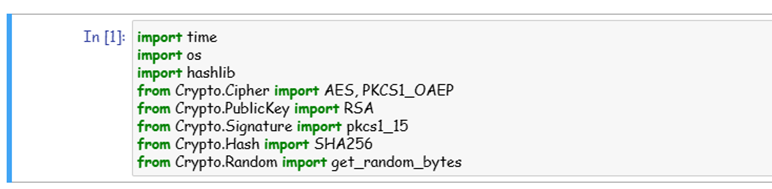

#### 📚 Tasks - 1 : AES encryption/decryption with two key lengths, 128 and 256 bits, and two modes ECB and CFB

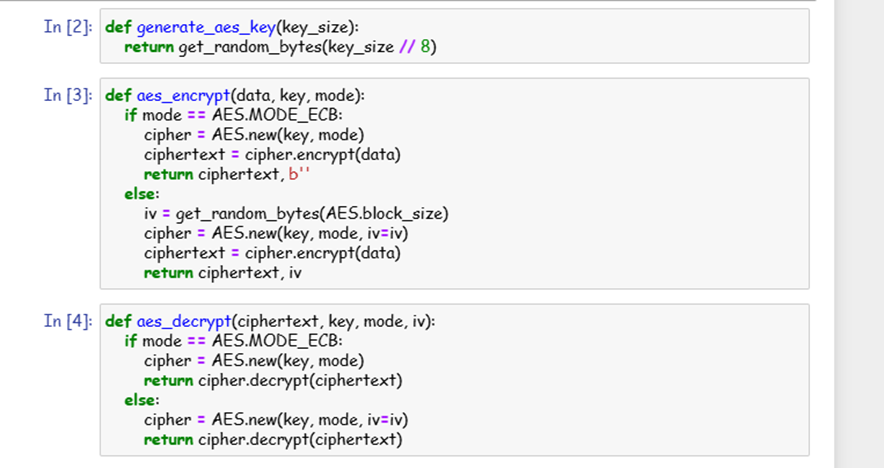

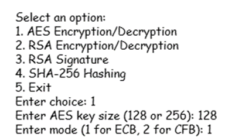

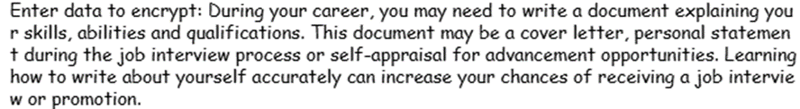

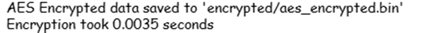

#### 📚 Tasks - 2 : RSA encryption and decryption

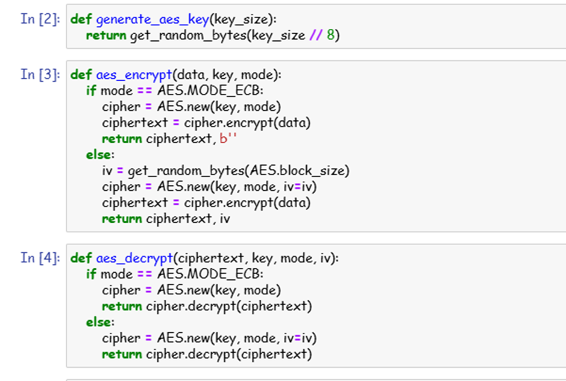

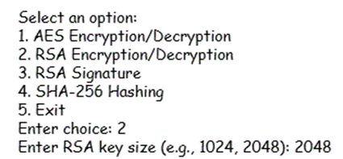

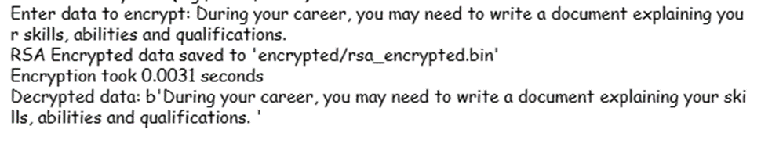

#### 📚 Tasks - 3 : RSA Signature

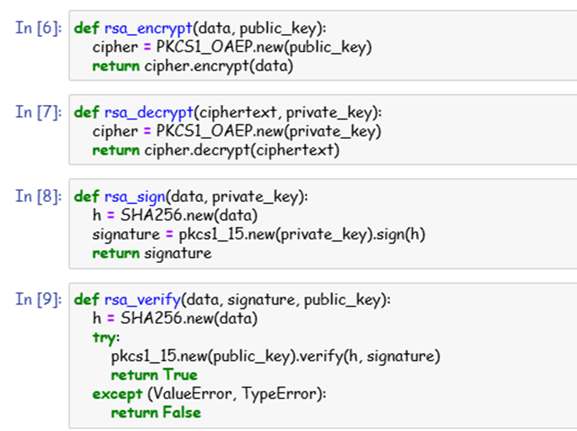

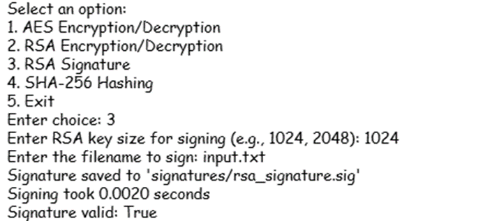

<h4> RSA signature </h4>

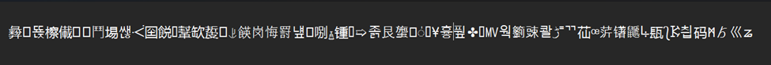

#### 📚 Tasks - 4 : SHA-256 hashing

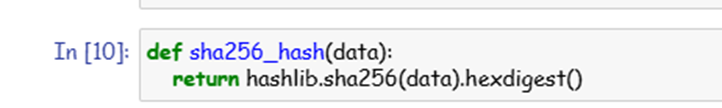

