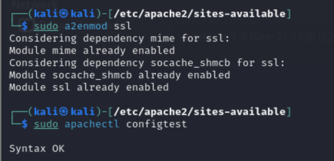

## 📝 Lab Assignment 5: : Securing Apache Web Server

- [✅ Tasks - 1 : Becoming a certificate authority](#-tasks---1--becoming-a-certificate-authority)

- [✅ Tasks - 2 : Creating a certificate for example.com](#-tasks---2--creating-a-certificate-for-examplecom)

- [✅ Tasks - 3 : Launching a simple web server with the certificate generated](#-tasks---3--launching-a-simple-web-server-with-the-certificate-generated)

- [✅ Tasks - 4 : Deploy HTTPS into Apache](#-tasks---4--deploy-https-into-apache)

### 🔖 Tasks - 1 : Becoming a certificate authority

1. **Configure openssl.cnf:**
   - Copying the openssl.cnf file from /usr/lib/ssl/openssl.cnf to current directory.
   - Modifying openssl.cnf to suit the requirements, focusing on adjustments within the [CA_default] section to define directories and settings appropriately.

2. **Generating a self-signed certificate for our CA, filling in necessary information such as Country Name, Common Name, etc.**

The output of the command is stored in two files: ca.key and ca.crt. The file ca.key contains the CA’s private key, while ca.crt contains the public-key certificate.

### 🔖 Tasks - 2 : Creating a certificate for example.com

1. **Generating public/private key pair :**

2. **Generating a Certificate Signing Request (CSR):**

3. **Generating Certificates:**
   - The names in your requests do not match with those of CA. So, OpenSSL refuses to generate certificates
   - Fix this and re-issue the above command

### 🔖 Tasks - 3 : Launching a simple web server with the certificate generated

1. **Combining the secret key and certificate into one file:**

2. **Launch the web server using server.pem:**
   

3. **Error message from the browser:**

4. **Manually adding our CA’s certificate to the Firefox browser:**

5. **In webpage, showing certificaticates’ details:**

### 🔖 Tasks - 4 : Deploy HTTPS into Apache

1. **Writing contents in /etc/apache2/sites-available/example.com.conf file:**

2. **Restarting the apache server:**

3. **Now, try to access the http://example.com. It’ll view the webpage in HTTPS:**

