## 📝 Lab Assignment 6: Securing Apache Web Server – 2

### 🔖 Tasks - 1 :

1. **Enable the mod_rewrite module using a2enmod command.**

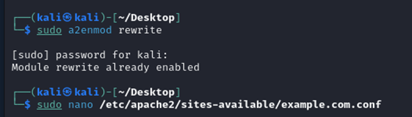

2. **Look at the /etc/apache2/sites-enabled directory to find the configuration file for port 80 for example.com**

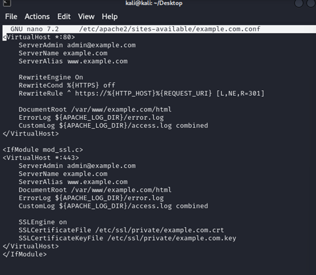

3. **Testing Apache configuration and restart the Apache server**

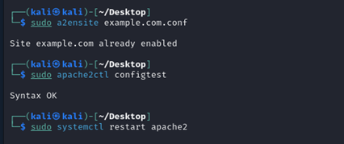

4. **Testing example.com on your browser. It’ll show “Hello, World!”**

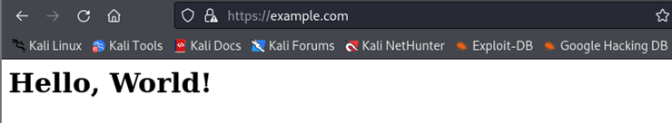

### 🔖 Tasks - 2 :

1. Adding users to Apache web server using the following command

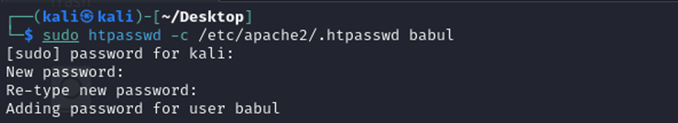
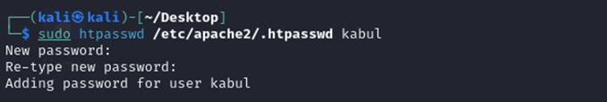

2. Use the following command to cat the contents of .htpasswd file.

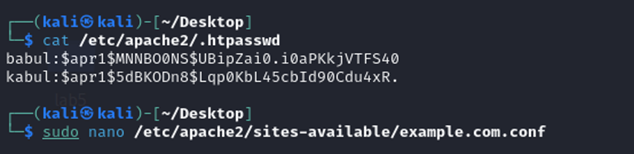

3. Adding a few lines into https configuration file for example.com.

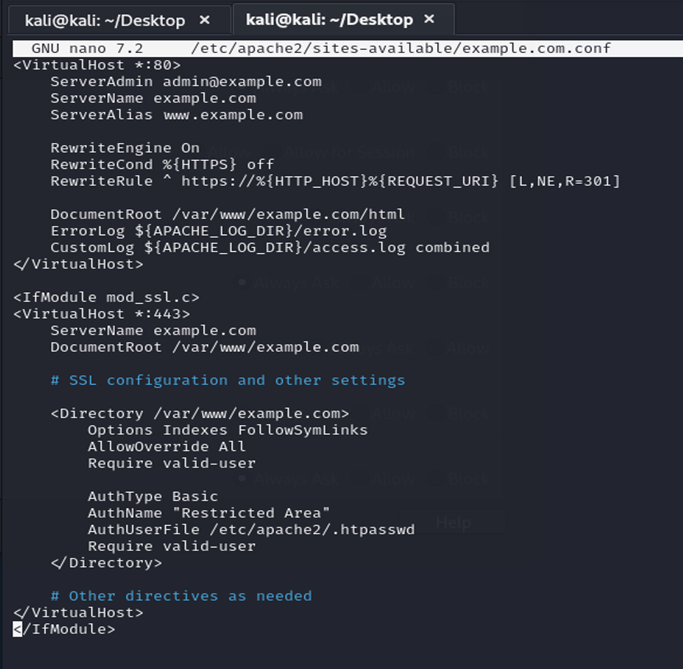

4. Restarting the apache server

5. When accessing to example.com, it’ll show a prompt to give username and password.

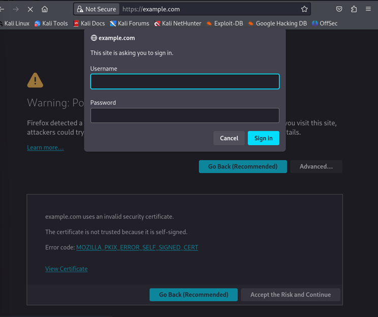

6. Now providing the username and password from before created.

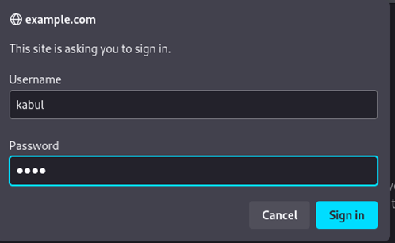

7. Now, I can access the site.

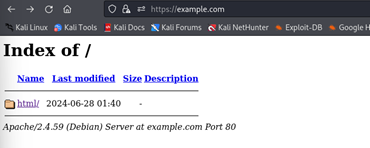
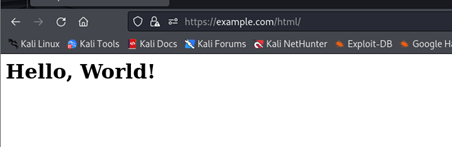

### 🔖 Tasks - 3 :

1. Installing and configuring Mariadb server on kali linux.

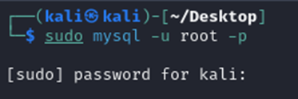
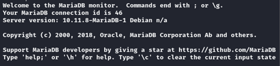

2. Creating a database called ‘apache’ and use the following command to use the apache database.

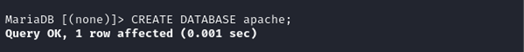

3. Creating a table called users

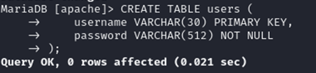

4. Instead of storing plain passwords in database, use the following command to create a hashed password for users named Sammy and Alice in a separate console.

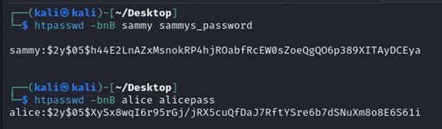

5. Now store the hashed password

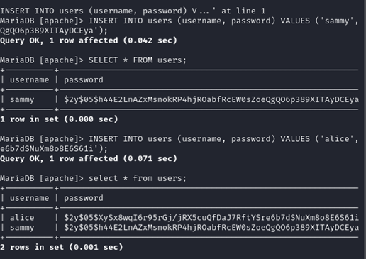

6. Enable the mod_authn_dbd module of Apache and modifying configuration file’s contents.

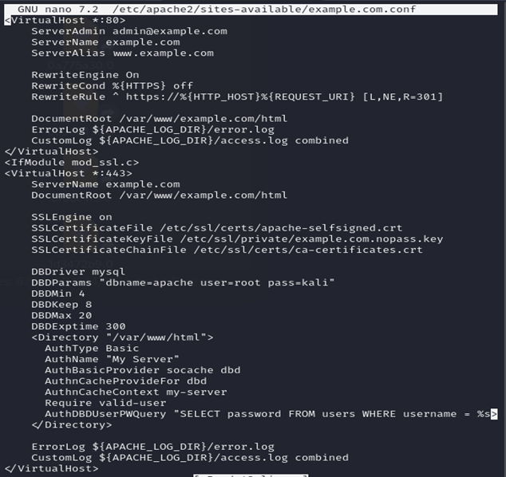

7. Restart the Apache server.
8. When accessing the example.com page, it’ll show a prompt for username/password. Providing the one that have in your MySQL database. Now you can access the page.

